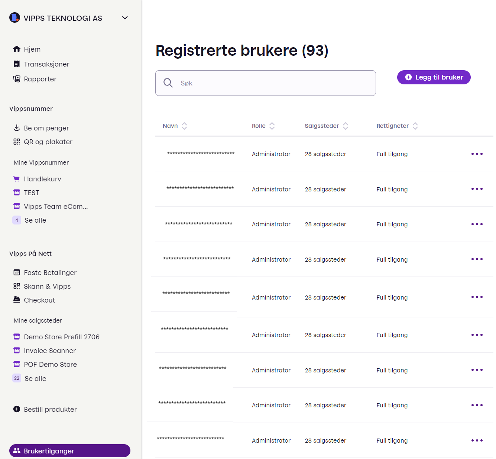

<!-- START_METADATA
---
title: How to add a user on the portal
sidebar_label: How to add a user on the portal
description: How a Vipps MobilePay partner can add a user through the partner portal.
sidebar_position: 30
pagination_next: null
pagination_prev: null
---
END_METADATA -->

# How to add a user on portal.vipps.no

<!-- START_COMMENT -->
ℹ️ Please use the website:
[Vipps MobilePay Technical Documentation](https://developer.vippsmobilepay.com/docs/partner/).
<!-- END_COMMENT -->

Partners should use
[partner keys](https://developer.vippsmobilepay.com/docs/partner/partner-keys).
If the partner has not implemented partner keys, there will be some manual work:
The merchant must retrieve the API keys on
[portal.vipps.no](https://portal.vipps.no)
and send them to the partner securely.

If the merchant is unable to provide the API keys to the partner securely, the merchant *can* create a user for the partner, so the partner can retrieve the API keys.

This is a step-by-step guide for that.

**Please note:** Access is provided for individuals.
It is not possible for a merchant to give access to a business (e.g., its partner),
only to specific people.
There is no limit to the number of people that can be given access.

1. Log in to the [merchant portal](https://portal.vipps.no) with BankID.

2. Select *Brukertilganger* (*User access*) in the sidebar to see the list of users.

    

3. Select *Legg til bruker* (*Add a user*). Enter the new user's phone number.

    

    The name of the person will automatically be displayed. Click *Neste* (*Next*).

4. Select the permissions for the user. A partner's user should have "Lese" (*Read*) and *Utvikler* (*Developer*) permissions.

    

    Click *Neste* (*Next*).

5. Select sales unit(s) the new user will get access to.

    

    Click *Ferdig* (*Done*).
