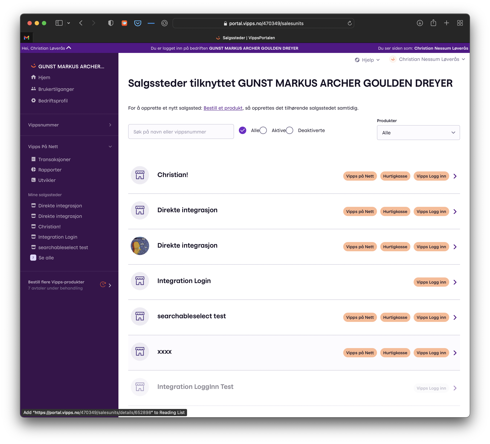
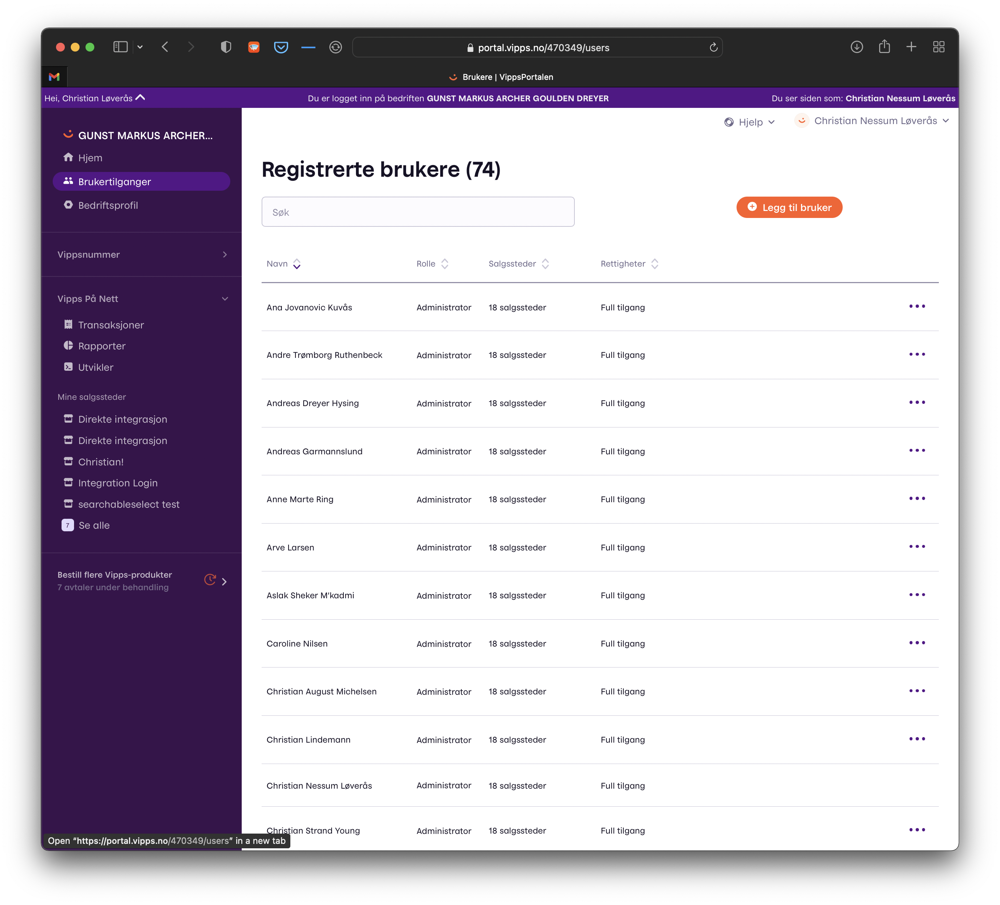
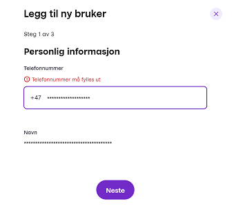
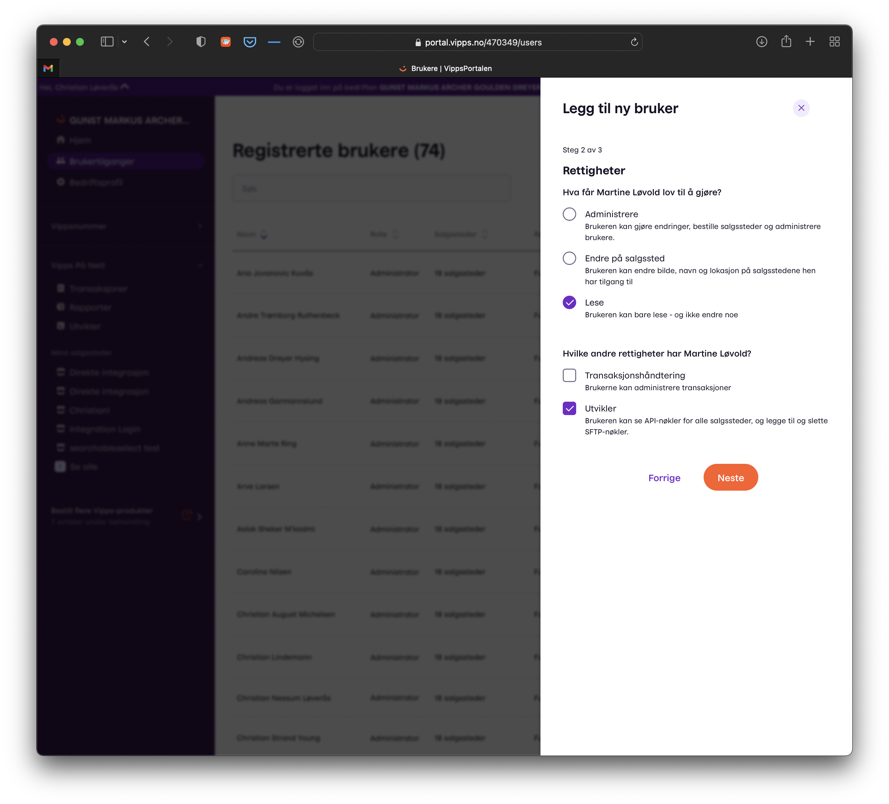
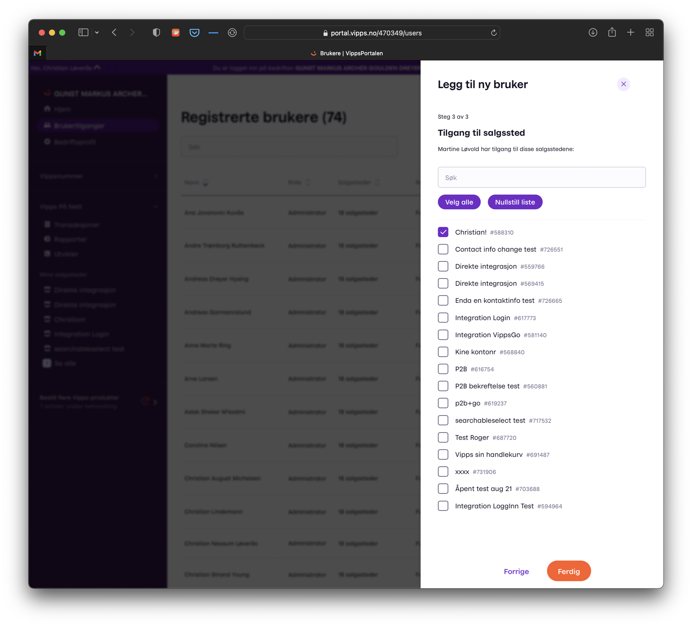
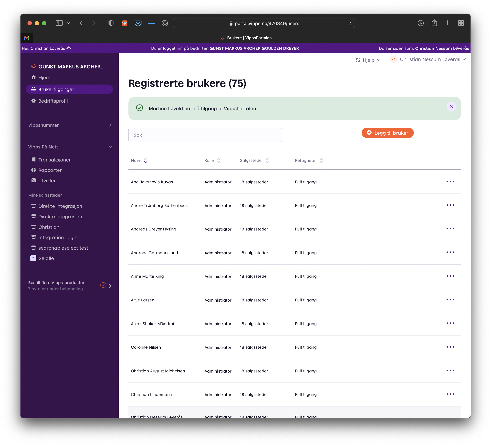

# How to add a user on portal.vipps.no

Partners should use
[partner keys](https://developer.vippsmobilepay.com/docs/vipps-partner/partner-keys).

If the partner has not implemented partner keys, there will be some manual work:
The merchant must retrieve the API keys on
[portal.vipps.no](https://portal.vipps.no)
and send them to the partner in a secure way.

If the merchant is unable to provide the API keys to the partner securely, the merchant _can_ create a user for the partner, so the partner can
retrieve the API keys.

This is a step-by-step guide for that.

**Please note:** Access is provided for individuals.
It is not possible for a merchant to give access to a company (like its partner),
only to specific people.
There is no limit to the number of people that can be given access.

# 1. Log in on portal.vipps.no

The merchant logs in with BankID on
[portal.vipps.no](https://portal.vipps.no)
and sees the main page.

Click "Brukertilganger" (*User access*) in the left menu:

# 2. See the list of users

The list of users is now shown.

Click "Legg til bruker" (*Add user*):

# 3. Enter the new user's phone number

A panel for adding a new user is shown.

Enter the phone number of the new user that will be added.

The name of the person will automatically be displayed.

Click "Neste" (*Next*).

# 4. Select permissions

The partner's user should have "Lese" (*Read*) and "Utvikler" (*Developer*) permissions.

Click "Neste" (*Next*).

# 5. Select sales units the new user will get access to

There merchant may have one or several sales units.

Choose the one(s) that the new user will get access to.

Click "Ferdig" (*Finished*).

# 6. Confirmation

That's it.

The confirmation screen looks like this:

