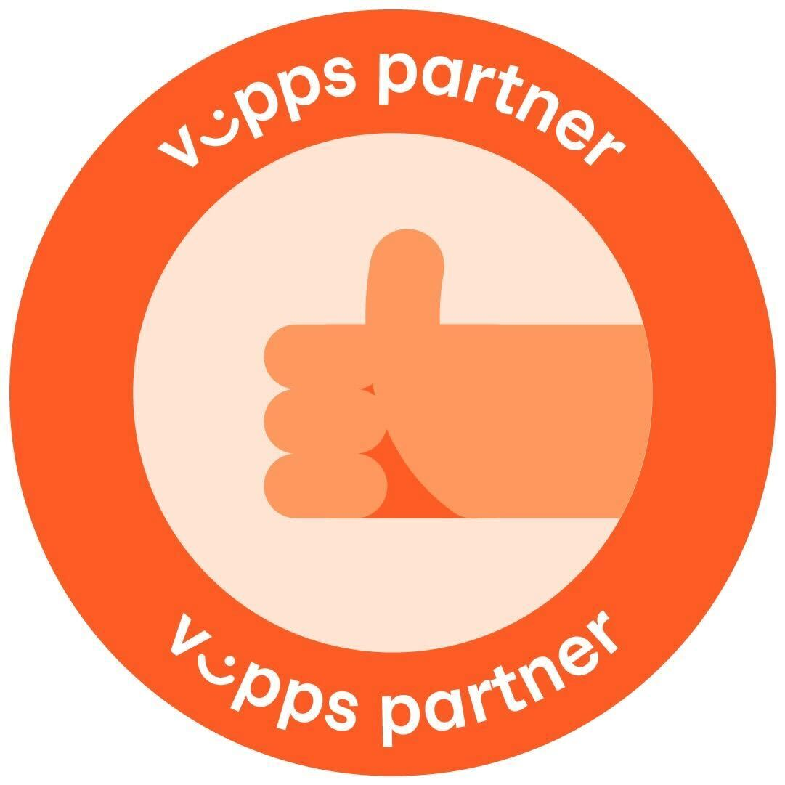

<!-- START_METADATA
---
title: Partner levels
sidebar_position: 10
---
END_METADATA -->

# Partner levels

<!-- START_COMMENT -->

ℹ️ Please use the new documentation:
[Vipps Technical Documentation](https://vippsas.github.io/vipps-developer-docs/).

<!-- END_COMMENT -->

<!-- START_TOC -->

<!-- END_TOC -->

| Vipps Partner                              | Vipps Partner Plus                         | Vipps Partner Premium                      |
| ------------------------------------------ | ------------------------------------------ | ------------------------------------------ |
|  |  | 
| Annual revenue < 15 MNOK                   | Annual revenue >= 15 MNOK                  | Annual revenue > 80 MNOK                   |
| Number of active merchants < 30            | Number of active merchants >= 30           | Number of active merchants >= 60           |
| Offer one Vipps product                    | Must offer more than one Vipps product     | Must offer more than one Vipps product     |
| Fixed price only.                          | Pricing according to agreement             | Pricing according to agreement.            |
| Must use the merchants' API keys           | Can use partner keys.                      | Can use partner keys.                      |  
| Self-service using the documentation.      | Self-service using the documentation.      | Self-service using the documentation.      |
| Support by email.                          | Support by email.                          | Support by email.                          |
| -                                          | Support by Slack.                          | Support by Slack.                          |
| -                                          | Possibility for commission.                | Possibility for commission.                |     
| -                                          | Presented on the Vipps website.            | Presented on the Vipps website.            |
| -                                          | Marketing cooperation possible.            | Marketing cooperation possible.            |
| -                                          | -                                          | Priority onboarding of merchants.          |
| -                                          | -                                          | Workshops with Vipps product teams, etc.   |
| -                                          | -                                          | Commit to quarterly training.              |
| -                                          | -                                          | Will get help with fixing API errors.      |
